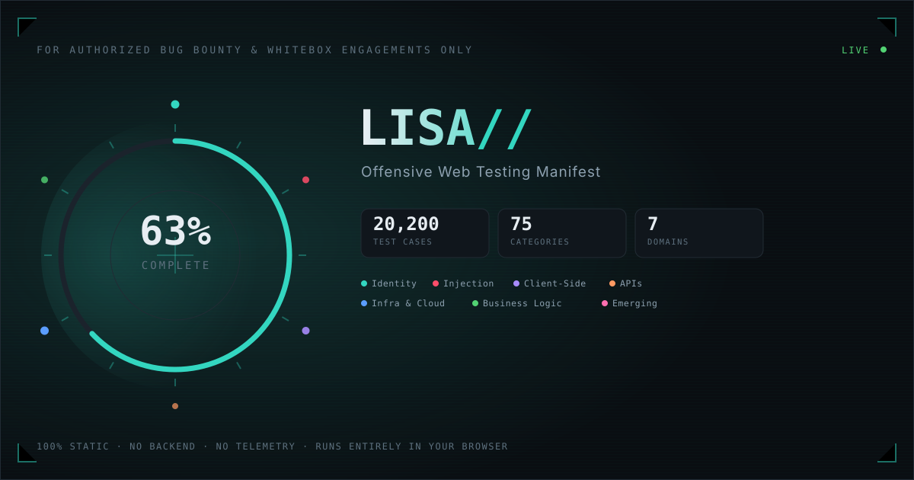
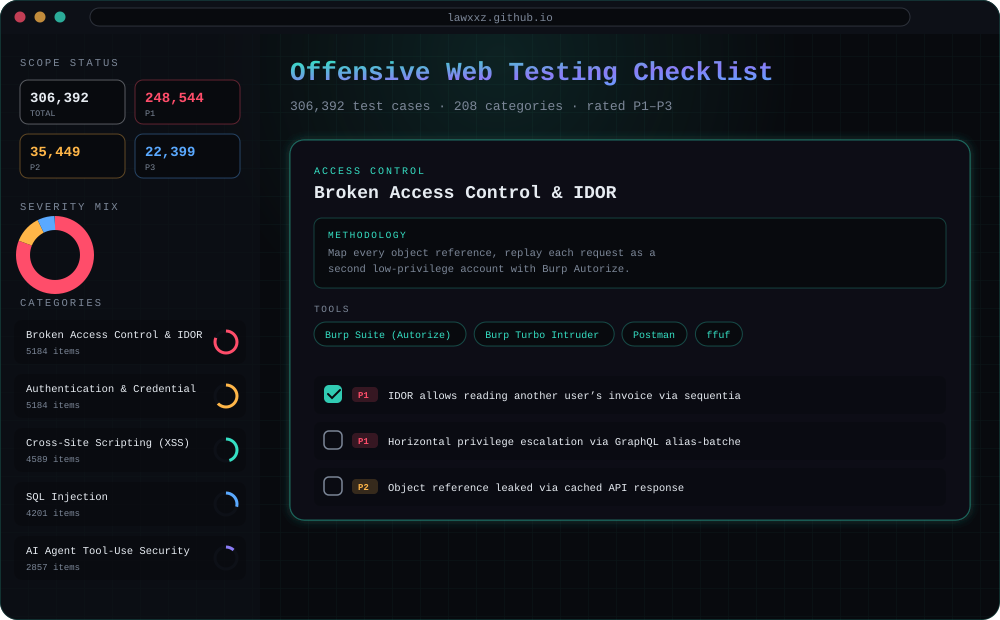

<div align="center">



<br/>


<br/><br/>

<!-- more tech & build badges -->
[](.)
[](.)
[](.)
[](.)
[](.)
[](.)

<!-- project stats — swap <user>/<repo> for your real path once pushed -->
[](.)
[](.)
[](.)
[](.)
[](.)
[](.)

<!-- thematic / identity badges -->
[](.)
[](.)
[](.)
[](.)
[](.)
[](.)
[](.)
[](.)
[](.)
[](.)
[](.)
[](.)
[](.)
[](.)
[](.)
[](.)

<sup>▲ replace the badge links above with your own repo URL once it's live — see <a href="#-deploy-to-github-pages-in-3-minutes">Deploy</a></sup>

</div>

<br/>

## ⚡ What is this

**LISA//** is a single, self-contained HTML page that turns a decade of bug bounty and whitebox pentest methodology into something you actually *use* during an engagement — not a PDF you skim once and forget.

- 🎯 **20,200 test cases**, organized into **75 categories**, grouped into **7 attack-surface domains** — from auth and session bugs through SSRF, GraphQL, cloud/IAM, Kubernetes, CI/CD supply chain, Web3 frontends, LLM/AI app security, and more.
- 🧠 Every category opens with a short **methodology tip** — a real "how to actually test this" note with a suggested tool, not filler text.
- 🗂️ **Multiple engagement profiles** — keep totally separate progress for every program or client you test.
- 🔒 **Nothing is ever sent anywhere.** No backend, no analytics, no cookies that leave the browser. Progress lives in `localStorage`, full stop.
- 📄 Deploys as-is to **GitHub Pages** — no build step, no `npm install`, no framework.

<br/>

## 🖥️ See it in action

<div align="center">

</div>

> **Note:** the image above is a UI mockup shipped with this repo so the README renders something meaningful before you've deployed. Swap it for a real capture once your site is live:
> 1. Record your own screen with [ScreenToGif](https://www.screentogif.com/) (Windows), [Kap](https://getkap.co/) (macOS), or [Peek](https://github.com/phw/peek) (Linux)
> 2. Save it as `docs/demo.gif`
> 3. Replace the `` above with ``

<br/>

## 📚 Table of contents

- [What is this](#-what-is-this)
- [See it in action](#-see-it-in-action)
- [Feature breakdown](#-feature-breakdown)
- [Motion design](#-motion-design)
- [The 7 domains](#-the-7-domains)
- [How it works](#-how-it-works)
- [Deploy to GitHub Pages in 3 minutes](#-deploy-to-github-pages-in-3-minutes)
- [Run it locally](#-run-it-locally)
- [Customizing the checklist](#-customizing-the-checklist)
- [Keyboard shortcuts](#-keyboard-shortcuts)
- [Privacy](#-privacy)
- [FAQ](#-faq)
- [Contributing](#-contributing)
- [License](#-license)

<br/>

## 🧩 Feature breakdown

<table>
<tr>
<td width="50%" valign="top">

### Track your work
- ✅ 20,200 clickable, persistent checkboxes
- 🚩 **Priority flags** — star anything worth revisiting
- 🟥 **Severity tags** — cycle `Critical → High → Medium → Low` per item, color-coded
- 📝 **Inline notes** — leave yourself a finding reference right next to the test case
- 🗂️ **Engagement profiles** — one checklist state per target, switch instantly
- 💾 Everything autosaves to `localStorage`, per profile

</td>
<td width="50%" valign="top">

### Move fast
- 🔍 **Live search** across all 20,200 items (`/` to focus)
- 🎛️ Filter by **All / Pending / Done / Flagged** and independently by **severity**
- 🌐 Filter by **domain cluster** (7 color-coded chips)
- 🎲 **"Surprise me"** — jump to a random unchecked item in view
- ⚡ **Check all / Clear all** per section (respects active filters)
- 📂 **Expand all / Collapse all**

</td>
</tr>
<tr>
<td width="50%" valign="top">

### Report out
- 🟢 **Animated SVG progress badge**, exportable and shareable
- 📄 Export to **Markdown** (checkbox syntax, ready to paste into a report)
- 📊 Export to **CSV** (cluster, category, severity, flag, notes — spreadsheet-ready)
- 🧾 Export/import **JSON** to move a profile between machines
- 🖨️ **Print-friendly view** — auto-expands everything, strips the UI chrome

</td>
<td width="50%" valign="top">

### Built to last
- 🌓 **Dark / light theme** toggle
- 📱 Fully responsive, touch-friendly (works on your phone mid-engagement)
- ♿ Keyboard-accessible, respects `prefers-reduced-motion`
- 🪶 Zero dependencies beyond two Google Fonts — no `node_modules`, ever
- 🔐 100% static — audit the entire thing by reading 4 files

</td>
</tr>
</table>

<br/>

## 🎛️ Motion design

The animation isn't decoration bolted on after the fact — it all points back to the same idea the progress ring already uses: **you are the sensor, the app is the display.**

| Where | What happens | Why |
|---|---|---|
| **Hero background** | A slow radar sweep rotates behind the headline, with faint ambient contacts drifting at random radii | Echoes the "target" progress ring on the right — the whole page reads as one radar scope, not just one widget |
| **Checking an item** | Fires a `lisa:ping` event that lands a bright green contact blip on the sweep, at a random point, fading over ~900ms | Turns "I found something" into visible, felt feedback instead of a silent checkbox tick |
| **Logo hover** | `LISA//` splits into a brief cyan/red chromatic-aberration glitch | A one-shot flourish, not a loop — the kind of thing you'd only ever see if you're actually looking at the logo |
| **Category cards on load** | Cards materialize with a blur-to-sharp fade, staggered in cascading batches as they scroll into view | Signals "there's a lot here, but it's organized" without a wall of content appearing all at once |
| **Primary button** | A soft light glow tracks your cursor inside the button | Small, standard, cheap — kept deliberately quiet so it doesn't compete with the hero |

Every animated piece respects `prefers-reduced-motion`: the sweep freezes to a single static frame, card reveals happen instantly, and the boot sequence is skipped entirely. The sweep canvas also pauses via `IntersectionObserver` when scrolled out of view and via the Page Visibility API when the tab isn't active — it never spends a frame budget you can't see.

<br/>


<div align="center">

| Cluster | Categories | Test cases | Covers |
|---|:---:|:---:|---|
| 🟦 **Identity & Access** | 6 | 2,180 | Authentication, sessions, authorization, account management |
| 🟥 **Injection & Input** | 15 | 4,444 | SQLi, NoSQLi, command injection, XSS, XXE, SSTI, LDAP/XPath, deserialization |
| 🟪 **Client-Side & Browser** | 12 | 2,898 | DOM/prototype pollution, postMessage, CSP, clickjacking, SPA routing, extensions |
| 🟧 **APIs & Protocols** | 7 | 2,000 | REST, GraphQL, gRPC/WebRTC, request smuggling, HPP, mobile gateways |
| 🟦 **Infrastructure & Cloud** | 16 | 4,289 | Cloud/IAM, Kubernetes, CI/CD, DNS/subdomain takeover, cache poisoning, rate limiting |
| 🟩 **Business Logic & Commerce** | 9 | 2,257 | Workflow abuse, race conditions, e-commerce, admin panels, reporting/export |
| 🟨 **Emerging & Specialized** | 10 | 2,132 | AI/LLM app security, Web3/dApp frontends, IoT, feature flags, i18n/RTL injection |

</div>

<sub>Every category also carries a short methodology tip — expand any section in the app to see it, or check `data.js` directly.</sub>

<br/>

## ⚙️ How it works

```
lisa-checklist/
├── index.html        # single page, all markup — no templating
├── data.js            # the 20,200-item dataset (id · title · cluster · methodology · items[])
├── css/
│   └── style.css       # dark/light theme via CSS custom properties, no preprocessor
├── js/
│   └── app.js           # ~1,500 lines, vanilla JS, no framework, no bundler
└── docs/
    ├── banner.svg          # this README's header
    └── screenshot-mock.svg   # UI mockup used above
```

**No build step.** Open `index.html` in a browser and it works. Push it to GitHub Pages and it works. There is no `npm run build`, no transpilation, no bundler config to fight with.

<details>
<summary><strong>🗄️ Storage model — click to expand</strong></summary>
<br/>

Everything lives in `localStorage` under a few namespaced keys:

```js
recon_checklist_profiles_v2   // { activeId, profiles: { id: { name, progress, flags, severities, notes } } }
recon_checklist_open_cats_v1  // which category cards are expanded (shared UI state)
recon_checklist_theme_v1      // "dark" | "light"
```

Each **profile** is fully independent:

```js
{
  id: "k3x9a2b",
  name: "acme-corp-2026",
  createdAt: "2026-07-13T06:10:00.000Z",
  progress:   { "1-42": true },              // catId-itemIndex → checked
  flags:      { "1-42": true },              // catId-itemIndex → starred
  severities: { "1-42": "critical" },        // catId-itemIndex → severity
  notes:      { "1-42": "confirmed on /auth/magic-link" }
}
```

Old single-profile installs migrate automatically into a `default` profile the first time the new version loads — nothing is lost.

</details>

<br/>

## 🚀 Deploy to GitHub Pages in 3 minutes

```bash
# 1. clone or create your repo, then drop these files in
git init
git add .
git commit -m "Initial commit — LISA// checklist"

# 2. push to GitHub
git branch -M main
git remote add origin https://github.com/<your-username>/<your-repo>.git
git push -u origin main
```

Then in your repo:

**Settings → Pages → Build and deployment → Source: `Deploy from a branch` → Branch: `main` / `(root)` → Save**

GitHub will hand you a live URL within a minute or two — usually:

```
https://<your-username>.github.io/<your-repo>/
```

That's it. No Actions workflow required (though you're welcome to add one — see [Contributing](#-contributing)).

<br/>

## 💻 Run it locally

No install needed — it's static HTML:

```bash
# any static server works, e.g.:
python3 -m http.server 8080
# or
npx serve .
```

Then open `http://localhost:8080`. Opening `index.html` directly via `file://` also works in most browsers.

<br/>

## 🛠️ Customizing the checklist

`data.js` is a single JS array assigned to `window.CHECKLIST_DATA`. Each category looks like:

```js
{
  "id": 1,
  "title": "Authentication",
  "cluster": "Identity & Access",
  "methodology": "Brute-force with Burp Intruder/ffuf against login, register, reset, and MFA endpoints; check for timing/response differences that reveal valid usernames.",
  "items": [
    "Weak password policy allows dictionary-based brute force",
    "..."
  ]
}
```

To add your own test cases: append strings to any category's `items` array. To add a whole new category: append a new object with a unique `id`, and make sure `cluster` matches one of the 7 existing cluster names (or add an 8th — the UI derives everything from the data, including the color legend, filters, and stat strip).

<br/>

## ⌨️ Keyboard shortcuts

| Key | Action |
|---|---|
| <kbd>/</kbd> | Focus the search box |
| <kbd>Esc</kbd> | Blur the search box |
| Click a severity badge | Cycle `— → Critical → High → Medium → Low` |
| Click the ⭐ | Toggle priority flag |
| Click the 🗒 | Toggle the inline note field |

<br/>

## 🔐 Privacy

There is no server component. There is no analytics snippet. There is no fetch call anywhere in `app.js` other than loading two Google Fonts. Your checklist progress, flags, severities, and notes are written to your browser's `localStorage` and read from nowhere else. If you clear your browser data, it's gone — that's also why the JSON export exists.

<br/>

## ❓ FAQ

<details>
<summary><strong>Will this sync across devices?</strong></summary>
<br/>
Not automatically — that would require a backend, and this project deliberately doesn't have one. Use <strong>Export JSON</strong> on one device and <strong>Import JSON</strong> on another to move a profile over.
</details>

<details>
<summary><strong>Can I use this for a real engagement right now?</strong></summary>
<br/>
Yes — that's the point. Create a profile per target, work through the relevant clusters, flag anything promising, tag severity as you go, and export a Markdown or CSV report when you're done.
</details>

<details>
<summary><strong>Why 20,200 items instead of a shorter, curated list?</strong></summary>
<br/>
Depth beats brevity here — the goal is to have <em>every</em> variant of a bug class on hand (different injection contexts, different auth flows, different cloud misconfig patterns) so nothing gets skipped because it didn't make a "top 50" list. Use the search, filters, and clusters to cut it down to what's relevant for your target.
</details>

<details>
<summary><strong>Does this replace Burp Suite / OWASP Testing Guide / my own methodology?</strong></summary>
<br/>
No — it's a tracker and prompt, not a scanner. Pair it with your existing tooling; the methodology tips point at the tools you'd already reach for.
</details>

<br/>

## 🤝 Contributing

Issues and PRs are welcome — new test cases, better methodology tips, corrections, or UI improvements. Since this is a static site, most contributions are just edits to `data.js`, `app.js`, or `style.css`. A GitHub Actions workflow that validates `data.js` (schema + duplicate check) on every push would also be a great addition if you want to open one.

<br/>

## 📜 License

MIT — see [`LICENSE`](LICENSE). Use it, fork it, rebrand it for your own team's methodology.

<br/>

<div align="center">

<sub>Built for people who'd rather be testing than tab-switching between fifteen PDFs.</sub>

</div>
